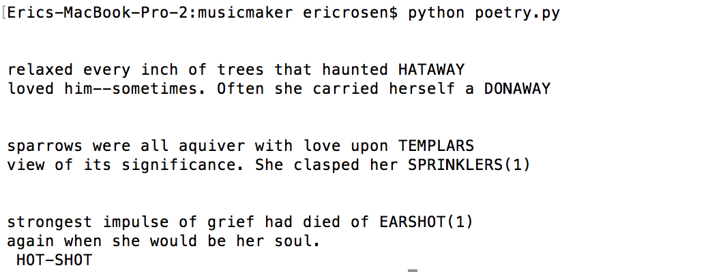

## Phoentic Connector

This was a small project I did to make a program that could help me find words with similiar phoentics. I used this to do things like, given a word, find a words that have same ending rhyming, middle rhyme, starting rhyme, ect. I also built a really basic markov text chain to produce lines of words that kind of made sense, and then added rhyme words at the end to make it poetry.

The file phoenetics.txt contains a large list of words and their associated phoenetic pronouciations. knowledge.txt is a text corpus that is used for the poetry part to produce sentences that kind of make sense.

follow_rhyme_words takes in a word in phoentics, and returns all words that have the starting phoenetic pronuciation of the ending phoenetic pronuciation of that word. For example, if you give it table, it may return bully, since the last phoentic pronouciation of table is "tay-bowl" and bully is "bowl-e".

word_rhyme tells you if two words have the follow_rhyme_words property. For example, word_rhyme(table,bully)==True, but word_rhyme(bully,table) == False.

initialize_phoeneitics adds all words in phoenetics to word_dict, which is a dictionary with key-value pairs of words and their phoenetic pronuciations.

initialize wiki initialized a wiki_dict where each word in knowledge.txt is a key, and the values are a dictionary of the words that follow the key and how often they follow that word. For example, in the sentence "the bear walks to the park. the bear eats the pear", wiki_dict[the] returns {bear:2}, and wiki_dict[bear] returns {walks:1, eats:1}.

next_wiki_word takes in a word in wiki_dict and returns a random word that follows it.

write_pair_lines writes a pair of poetry by randomly generating two sentences using next_wiki_word, and then adding two rhyme words at the end to make the sentences rhyme.
